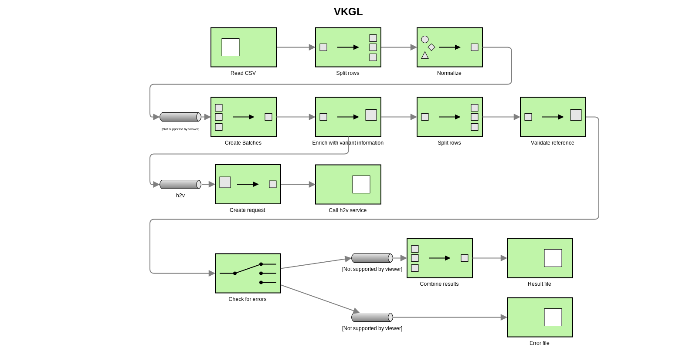

# vkgl

Variant annotator for vkgl variant sharing. Consists of two parts:

## HGVS translator

The active HGVS translator service code lives in another
[repository](https://github.com/molgenis/molgenis-ops-docker/blob/master/prod/variant-formatter/server.py)
. The service uses the [`biocommons/hgvs`](https://github.com/biocommons/hgvs) library to convert
HGVS to VCF. To start the translator service:

```
> cd docker
> docker-compose up
```

To see it in action, post an array of HGVS strings to the h2v endpoint:

```
curl -H 'Content-Type: application/json' -d '["NM_000088.3:c.589G>T", "NC_000017.10:g.48275363C>A"]' 'http://localhost:1234/h2v?keep_left_anchor=False'
```

These string can either be genomic HGVS (`NC_000017.10:g.48275363C>A`) or transcript
HGVS (`NM_000088.3:c.589G>T`). Two flags can be set for this service:

| Flag | Usage | Example |
| ---- | ----- | ------- |
| `keep_left_anchor` | The service can either return variants with the last unchanged nucleotide (=left anchor), or without it. Please note that this will go for all variants, including insertions for which an anchor is preferred. | `True`: `{"ref": "CT", "alt": "CC", "chrom":"19", "pos":"49473113", "type":"sub"}`
|      |        | `False`: `{"ref": "T", "alt": "C", "chrom":"19", "pos":"49473114", "type":"sub"}` |
| `strict` | The strict mode of the HGVS libary will be applied when strict is set to `True`. This means that validation warnings will result in errors rather than just warnings. ||

## file processing pipeline

[Spring Boot](https://spring.io/projects/spring-boot) application that uses
[Apache Camel](http://camel.apache.org/) to read input files from `src/test/inbox`
and annotate the lines with vcf info retrieved from the hgvs annotator.

Results will be stored in results dir once finished. Results with an error message will be routed to
error file.

Requires JDK 11. To run the pipeline:

```
> mvn spring-boot:run -Dspring-boot.run.arguments=--hgnc.genes="location/of/your/hgnc/genes/file"
```

Scroll down for more information about the HGNC genes file.



## Gene validation (HGNC genes file)

Validation and correction of provided HGNC symbols is done using an export downloaded from
[the biomart website](https://biomart.genenames.org/martform/#!/default/HGNC?datasets=hgnc_gene_mart)
. The selected attributes are:

- HGNC ID
- Status
- Approved symbol
- Approved name
- Alias symbol
- Previous symbol
- Chromosome
- Chromosome location
- Locus group
- NCBI gene ID
- Ensembl gene ID
- UCSC gene ID

The downloaded file is named `hgnc_genes.tsv` and is stored in `src/main/resources`. To have the
most accurate validation, it is recommended to update this file before running the pipeline.

## Consensus generator application

The org.molgenis.consensus package contains the ConsensusGeneratorApp command-line application to
produce a consensus file using the output of the data-transform-vkgl pipeline. Run the application
for more information.